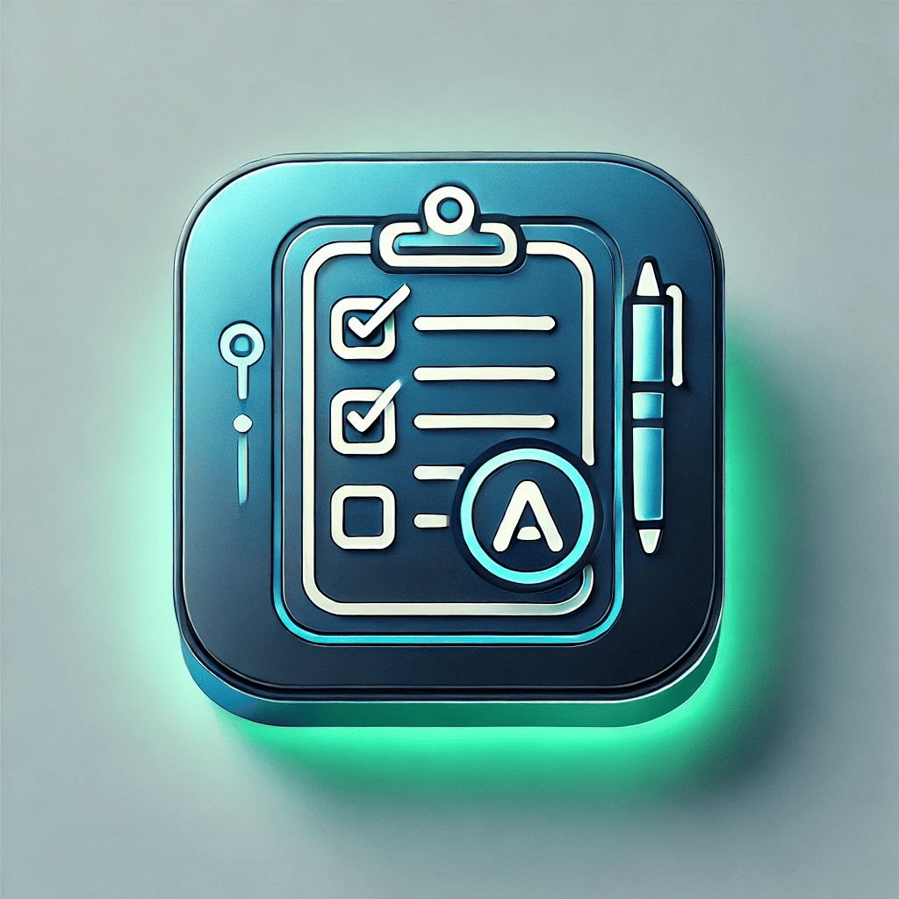

# AssignMate

## GoTo:

- [Downloading](#download-attendease)
  - [Requirements](#requirements)
- [About](#about)
- [Features](#features)
- [Screens](#screens)
  - [Feature Screens](#feature-screens)
- [Bugs and Issues](#bugs-and-issues)
- [Contributing](#contributing)
- [Supporting](#supporting)

## Download AssignMate
Get the apk [here!](https://github.com/ABHIRAM-AP/AssignMate/releases/tag/v0.0.1)

### Requirements
- Android 11 and above
- 40Mb of Free Space :)

## About
AssignMate is an assignment tracking app that allows students who miss classes to quickly access assignment details.
It also provides an internal calculator to calculate internals of a particular subject.
Students can login directly with their email and password, and veiw the data.
Once logged in, the students are not required to re-login, and just reopen the app again to view their data!

## Features
 - Students can quickly access their assignment details even if they miss a class.
 - 

## Backend and Database
The Whole Backend is Done using Firebase. FireStore is used as Database for storing Assignment Details, Class Rep Details and Student Details.

## Future Releases
AssignMate will thrive with future releases for sure. New features planned for implementation include:
- Downloading of Assignments and Resources.
- Results Viewing and Academic Performance Tracker.

## Bugs and Issues
If you encounter a bug, calculation errors, or something, feel free to create an issue. Please include detailed explanation and if you have any ways to solve them, do mention that too!

## Contributing
Ofcourse anyone can contribute to this, just do the below:
- Fork the Project
- Implement what you're planning
- Create a Pull Request
I'll surely merge after looking through it!

## Supporting
If you like the project/app, do star the repository! It'll do nothing but motivate!
